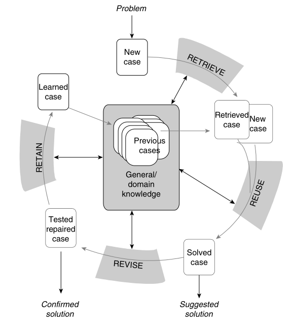
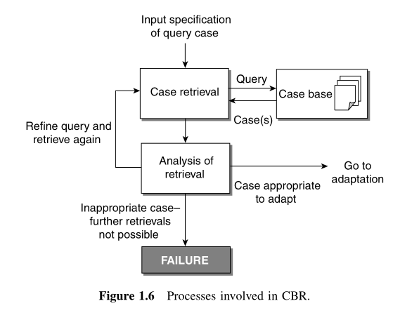

# FOUNDATIONS OF SOFT CASE-BASEDREASONING

##### CBR流程

---
## 实例表示 (cace representation)
- cases may need to be decomposed to their subcases
-  features have to be represented in some format: simple Boolean, numeric, and textual data to binary files, time-dependent data, and relationships
between data
-  a case must store information that is both relevant to the purpose of the system and will also ensure that the most appropriate case is retrieved to solve each new problem situation
-  not all of the existing cases need to be stored，相似的只需保留一个，也可自己创建一个实例。

> cases are assumed to have two components: problem specification and solution.

##### 存储的数据结构
-  flat case base
-  hierarchical structure： for a system solving classification problems.

## 实例索引 (Case Indexing)
- Indexes must be predictive in a useful manner.
- Indexes should be abstract enough to allow retrieval in all the circumstances in which a case will be useful, but not too abstract.

## 实例检索(Case Retrival)
> 检索过程高度依赖于所使用的记忆模型(memory model)和索引过程( indexing procedures)

##### 传统检索方法
- Nearest-neighbor retrieval (最近邻)
- Inductive approaches (归纳法)
- Knowledge-guided approaches
- Validated retrieval(验证性检索)

##### 影响检索因素
- 数据库的大小
- 可利用的领域知识的大小
- 每个特征的权重
- 索引情况

##### 考虑修改难度时的影响因素
>修改a distant case比重新检索一次消耗的时间更长

- 修改的时间和资源
- 实例库中的实例数目（接近实例的可能性）
- 检索的时间和资源
- 检索出多少实例
###### CBR过程

## 实例修改（Case Adaptation）
> It has been argued that adaptation may be **the most important step** of CBR since it adds intelligence to what would otherwise be simple pattern matchers.

##### 修改方法
- 直接使用检索出来的实例，不经修改；或者修改之后并不完全匹配需求。
- 。。。
- 。。。

## 实例学习和存储(Case Learning and case-base maintenance)
